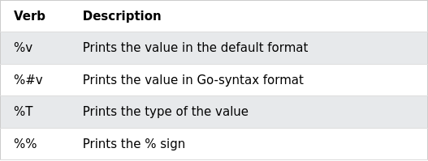

# Go lang session - draft

## Installation
### Ubuntu 
```sh
sudo apt install golang-go
```
### Other linux
```sh
wget -qO- 'https://go.dev/dl/go1.17.6.linux-amd64.tar.gz' | sudo tar -C /usr/local -xz
echo 'export PATH=$PATH:/usr/local/go/bin' >> "${HOME}/.profile"
```
## Hello world
```go
package main 

// same like #include in c++
import "fmt"

// special function(same as `int main()` in c++), which is called when program is executed
func main(){
	
    // printf("Hello world!")
    fmt.Println("Hello world!")
}
```
```sh
$ go run hello.go
# else to get executable
$ go build hello.go

```
## Variable
```go
var mystr string
mystr = "Hello world!"
// or in short form
// mystr := "Hello world!   (only inside fuction)


// Multiline string
str1:=`asfj
dfad
adf
`
num1 := 8          // int
num2 := 4.         // float64
num3 := 1 + 7i     // complex128
num4 := byte('c')  // byte (alias for uint8)
var a rune = 'ก'  // int32 and represent Unicode code.

// short declaration
// num1, num2,num3,num4,a := 8,3., 1+7i,byte('c'),rune('ก')

var u uint = 24      // uint (unsigned)
var p float32 = 3.14  // 32-bit float


// Array are initialized with 0 by default
var arr [5] int
fmt.Println(arr)

// Initializing
// arr := [5] int{1,3,2,5,7}
//fmt.Println(arr)

// Initializing 
// arr := [...] int{1,3,2,5,7}
//fmt.Println(arr)

//Initializing slize
myslice := [] int{1,3,2,5,7}
fmt.Println(arr)
myslice = append(myslice,1)
fmt.Println(myslice)
// https://gist.github.com/GimmyHchs/33bd06e68d72a913a8587b09d41b50d0


import ( 
   "fmt"
   "reflect"
)

fmt.Println(reflect.TypeOf(arr),len(arr),cap(arr)

```

## Formatting
`fmt.Printf` - Print formatter eg: `fmt.Printf("%d + %d = %d\n", num1, num2, num3)`   
`fmt.Print` - Print, just prints given vars eg: `fmt.Print(num1,num2,num3,"\n")`   
`fmt.Println` - Print line, ends with `\n` eg: `fmt.Println(num1,num2,num3)`

```
fmt.Printf("%v %v\n",a ,b )
```

https://yourbasic.org/golang/fmt-printf-reference-cheat-sheet/
https://www.w3schools.com/go/go_formatting_verbs.php



## Control flow
### If, else, else if
```go
var day sting
fmt.Scanln(&number)
noClass:=1

if day == "Sunday" || day == "Saturday" {
	sleep()
} else if day == "Wednesday" && noClass == true 
	sleep()
else
    study()
  
 ```
 ### For Loop

 ```go
 for num := 0; num <= 10; num++ {
  fmt.Println("This is", num)
}
 ```
### Switch case

```go
// Multicase also supported
var log_level int
switch log_level {
    case 1,4 :
        fmt.Println("Log level : Off")
    case 2 :
        fmt.Println("Log level : Error")
    case 3 :
        fmt.Println("Log level : Warning")
    default:
        fmt.Println("Log level : Info")
}
```
### For - Range loop
```go
cs_club := []string{"CP","EDITH","Networking","PRIT"}
for i,div := range cs_club {
    fmt.Printf("%d) %s\n",i+1,div)
}

// '_' omits the value
// for _,div := range cs_club {
//     fmt.Printf("%s\n",i+1,div)
// }
```
 ### While loop
 ```go

// function gets input and returns it
// func <function name> (<parameters>) (<return types>){ ...}
func get()(number int)
{
    var number int
    fmt.Scanln(&number)
    return
}


secret := 12
guess :=0

//while loop
for guess !=secret{
    guess=getint()
}

 ```
## Functions
```go
// function gets input and returns it
// func <function name> (<parameters>) (<return types>){ ...}
func get()(int)
{
    var number int
    fmt.Scanln(&number)
    return number
}


// Multiple return values
// func get()(int)
// {
//     var number,index int
//     fmt.Scanln(&index)
//     fmt.Scanln(&number)
//     return index,number
// }

// Named return values
// func get()(index , number int)
// {
//     fmt.Scanln(&index)
//     fmt.Scanln(&number)
//     return
// }


secret := 12
guess :=0
index:=0
//while loop
for guess !=secret{
    index,guess=getint()
}
```

## Interface 
```go
// Interface
type Shape interface {
  Area() float64
  Perimeter() float64
}

// Struct
type Rectangle struct {
  Length, Width float64
}

// Methods
func (r Rectangle) Area() float64 {
  return r.Length * r.Width
}

func (r Rectangle) Perimeter() float64 {
  return 2 * (r.Length + r.Width)
}


func main() {
  var r Shape = Rectangle{Length: 3, Width: 4}
  fmt.Printf("Type of r: %T, Area: %v, Perimeter: %v.", r, r.Area(), r.Perimeter())
}
```

